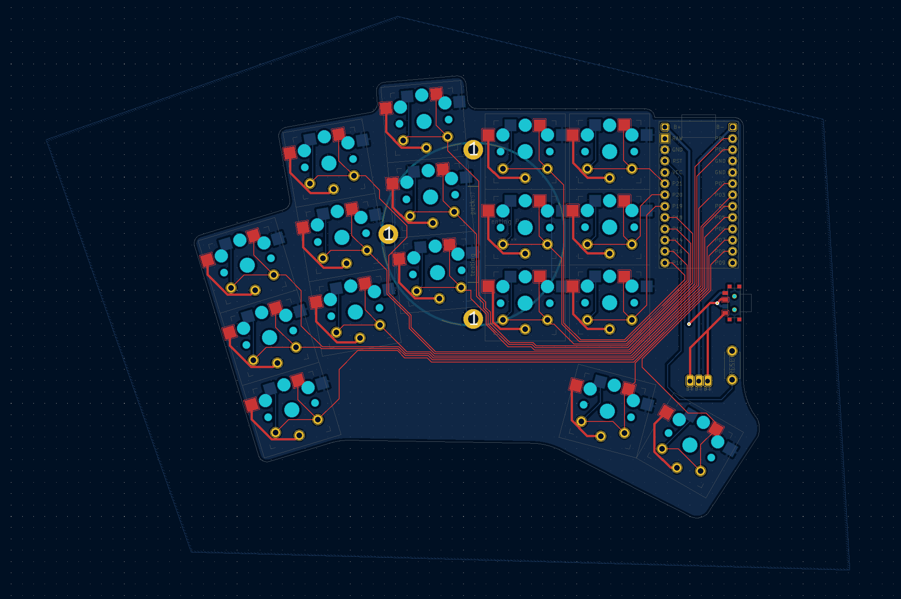

This is a mod of the [Rae-Dux](https://github.com/andrewjrae/rae-dux)

I made this board for the following reasons:

- 34 keys
- Wireless
- Customized it to fit my hand (my index finger is shorter than my ring finger)
- Added Tenting Puck support

Here's how the board looks like:

The shield for it can be found [here](https://github.com/AlaaSaadAbdo/zmk-config/tree/master/config/boards/shields/34w_ducks) 
