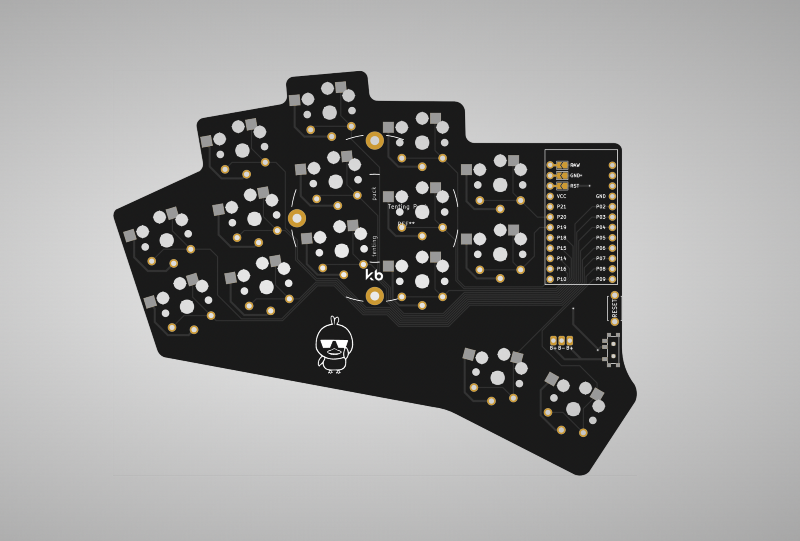

batta is a mod of the [Rae-Dux](https://github.com/andrewjrae/rae-dux) which was inspired by [Architeuthis dux](https://github.com/tapioki/cephalopoda/tree/main/Architeuthis%20dux)

I made this board for the following reasons:

- 34/30 keys
- Wireless
- Diodeless
- Tenting Puck support
- Customized it to fit my hand (my index finger is shorter than my ring finger)
- JST battery switch support

The ZMK shield for it can be found 
[batta](https://github.com/AlaaSaadAbdo/zmk-config/tree/master/config/boards/shields/batta) 
[battoota](https://github.com/AlaaSaadAbdo/zmk-config/tree/master/config/boards/shields/battoota) 

Here's how the PCB looks like:

## Batta - 34 keys
 

## Battoota - 30 keys
 