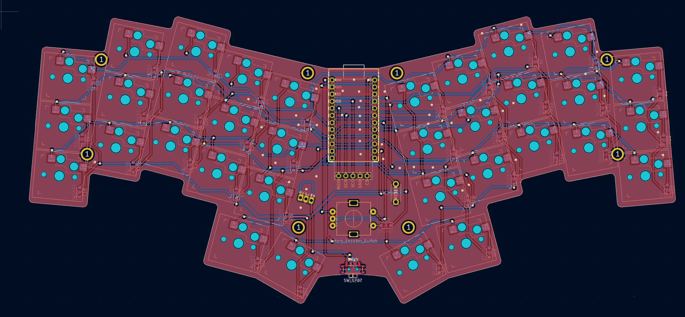
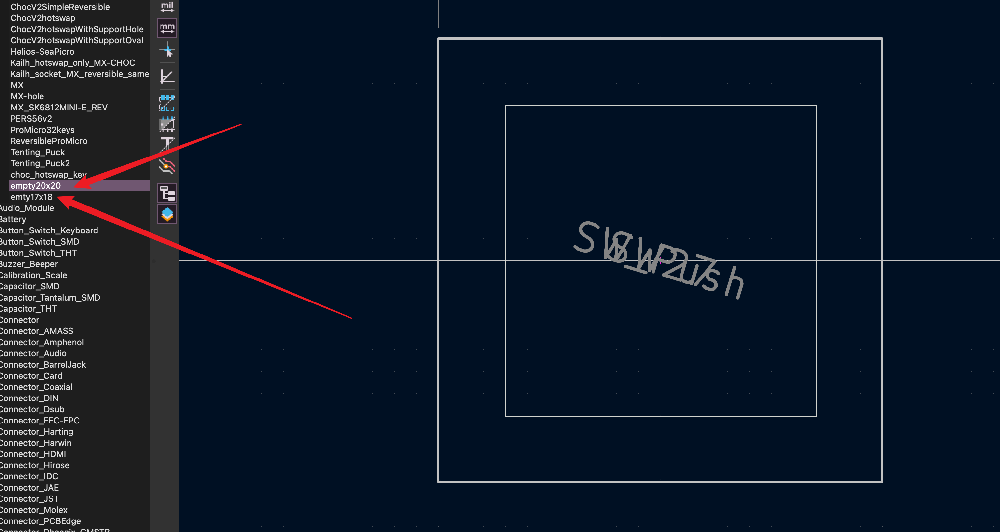
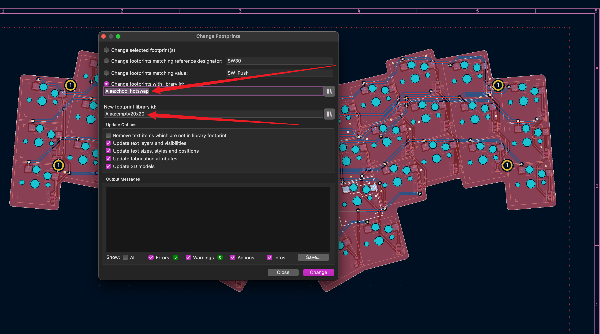
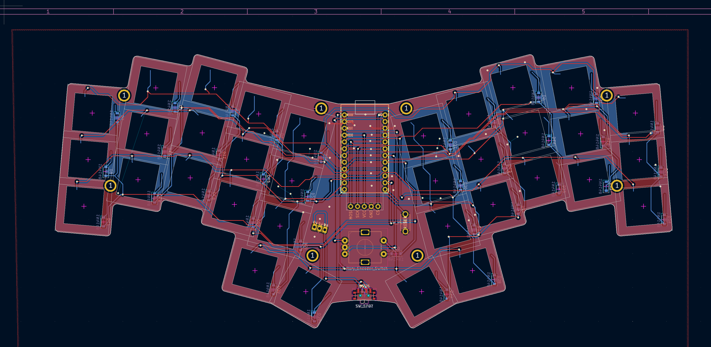
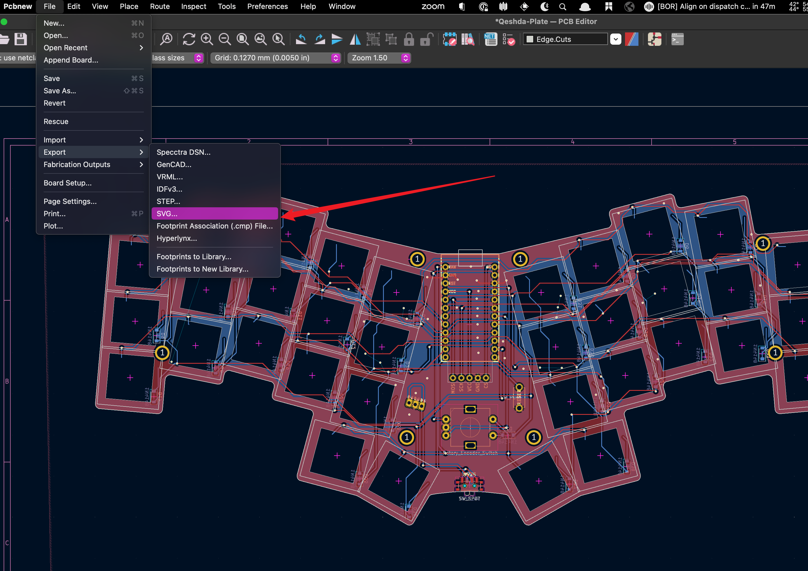
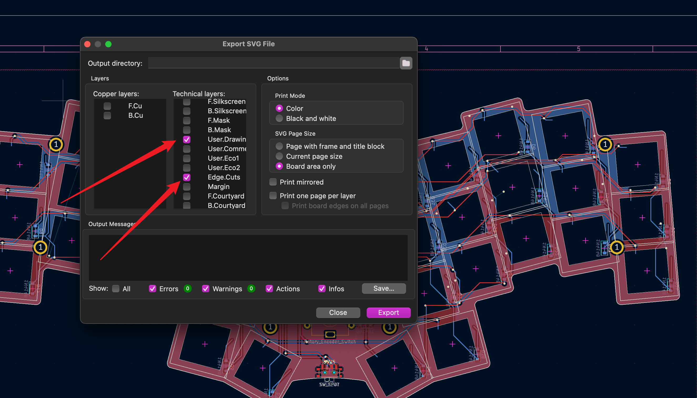
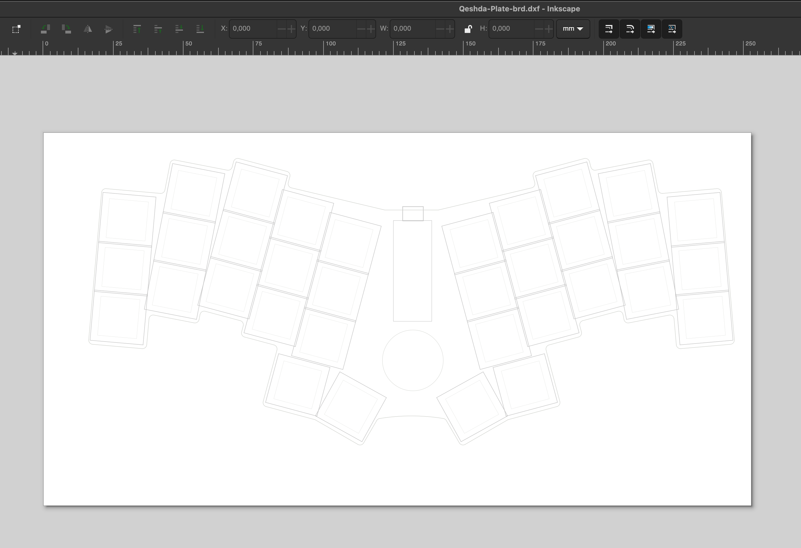
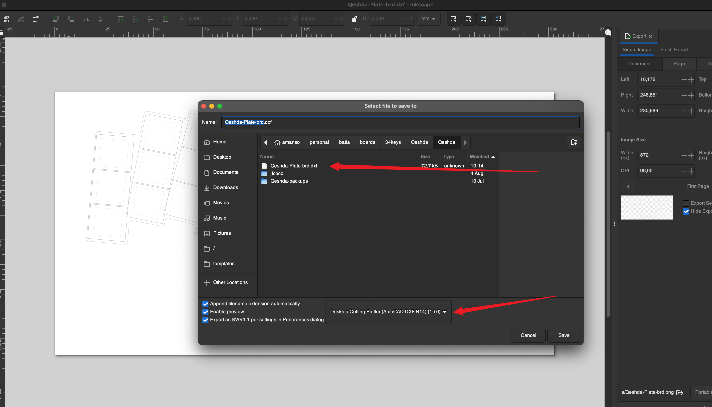
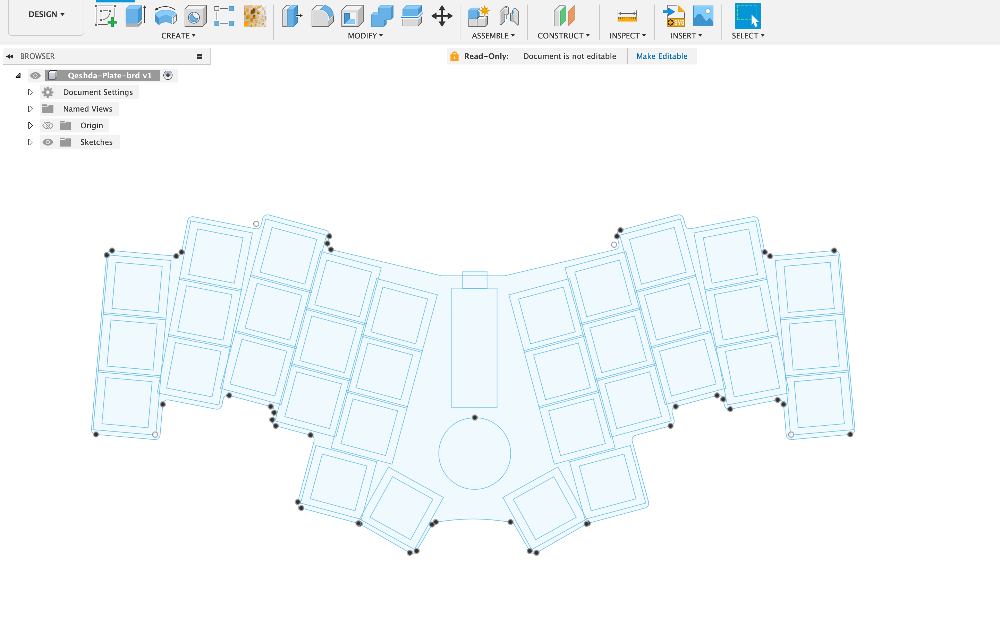

# How to generate a DXF from kicad to use in Fusion 360

I will be using [Qeshda](../boards/34keys/Qeshda/Qeshda/) as an example to generate a DXF for.  

1. Make a footprint with the dimentions you need. I have a footprint for Choc and MX. The footprint has an edge cut for the switch 14x14 and a user drawing for the keycap 20x20 or 18x19 
   
2. Replace all the switch footprints in pcbnew with the desired footprints 
   
3. You'll end up with a pcb that looks similar to this 
   
4. You can now export the layers you want as an SVG 
     
    
5. You can now open the SVG in incape and save the file as a DXF file 
   
   
6. You can now import the DXF into fusion and use it as a sketch to base your design on 
   

## Alternative DXF export via kicad directly

You can always use the Plot (File > Plot) function to plot DXF directly from kicad.  
The catch is that kicad doesn't handle curves well and will end up generating a lot of small lines instead of an arc which makes using the sketch very slow.

